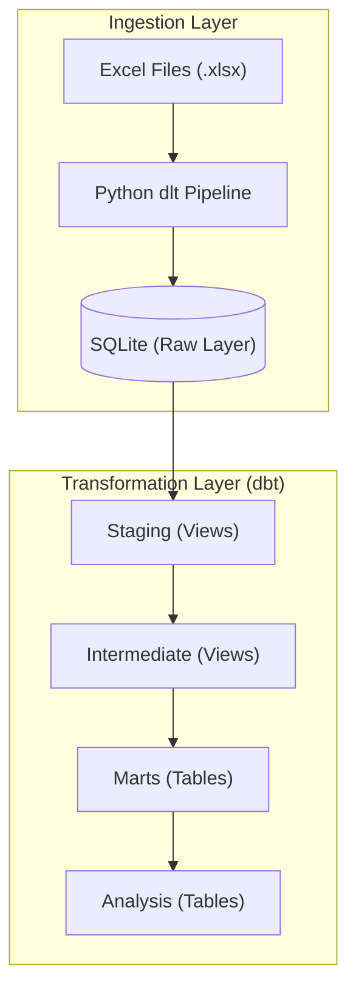

# SumUp Analytics 

## Overview
This pipeline builds an analytics data warehouse from SumUp's transaction ecosystem using **Python (dlt)**, **dbt**, and **SQLite**.

### Pipeline & Architecture


---

## Technical Reasoning & Design Decisions

### 1. Tech Stack Rationale
- **dlt (Data Loading Tool):** Chosen for its flexibility in handling various data sources and destinations. It is Python-based, making it easy to maintain and extend within the existing Python ecosystem.
- **SQLite:** Selected for this specific assigment to ensure simplicity, zero-configuration setup, and easy portability. **Note:** In a production environment, this would be replaced by a robust data warehouse like Snowflake, BigQuery, or PostgreSQL, and the `dlt` pipeline setup would remain largely the same.

### 2. Medallion Architecture (Layered Data Flow)
Following a 3-layer separation to balance data integrity, reusability, and performance.

| Layer | Materialization | Location | Reasoning |
|-------|----------------|----------|-----------|
| **Staging** | `View` | `models/staging` | Source-oriented; performs extraction, cleaning, and type-casting. |
| **Intermediate**| `View` | `models/intermediate` | Performs joins and shared business logic. |
| **Marts** | `Table` | `models/marts` | Business-oriented; final Fact and Dimension tables for BI. |
| **Analysis** | `Table` | `models/analysis` | Specialized models answering specific business questions. |

**Intermediate Layer**
Even when simple, this layer provides a modular bridge between raw staging and final facts, makes it more flexible and modular for future use cases. 
1. Current Use: Resolves the relationship between Transactions and Stores (via Devices) in one place, so downstream facts don't need to repeat join logic.
2. Future Use: Encapsulating what defines a "billable" or "valid" transaction (e.g., status filters) to ensure consistency across all reporting or deduplication if needed

**Seeds**
- Seed: `seeds/device_descriptions.csv` adds assumed device descriptions for demo purposes and not used through out the analysis

**Tests**
- `tests/transactions__timestamps_valid.sql`: Checks if transaction_at is after record_created_at
- `tests/stores__creation_after_first_transaction.sql`: Checks if store creation is after first transaction


### 3. Modeling Strategy
- **Normalized Facts:** `fact_transactions` contains only foreign keys and measures, ensuring scalability and consistency.
- **Store Attributes:** The latest state for store details in `dim_stores`

### 4. Incremental Loading Strategy: 
- **`merge` over `append`**: `stg_transactions` uses the `merge` strategy on `transaction_id` 

### 5. SKU Cleaning & Macro Usage
- **DRY Logic:** A custom macro `clean_product_sku` is used in the staging layer.
  - *Reasoning:* This centralizes the logic to strip 'v' prefixes and handle numeric formatting issues. Implementing this at the dbt layer ensures it's easily testable and reusable across any model referencing SKUs.

### 6. Transaction Status Logic
- **Successful vs All:** 
  - Top 10 rankings use **Successful** transactions only to reflect real revenue.
  - Performance/Adoption metrics use **All** transactions.
  - *Reasoning:* Failed transactions still represent platform activity and device usage, providing a truer picture of adoption and technical performance.

### 7. Top-N models with variables: 
Use window functions to expose a `rank` column (e.g., `DENSE_RANK() OVER (ORDER BY total_amount DESC)`), then filter with `WHERE rank <= var('top_stores_n', 10)` or `var('top_products_n', 10)` instead of hard-coding `LIMIT 10`. This keeps the model reusable for top 5/10/15 without code changes (override via `dbt run --vars '{"top_stores_n": 15, "top_products_n": 5}'`).

---

## Main Analysis Models
These core models answer the primary business questions regarding performance and engagement.

### 1. Performance Rankings
- **Top 10 Stores** (`top_10_stores.sql`): Identifies key accounts by ranking stores based on total successful revenue.
- **Top 10 Products** (`top_10_products.sql`): Highlights best-selling items based on total successful revenue.

### 2. Market & Device Insights
- **Device Mix** (`percentage_transactions_by_device.sql`): distribution of transactions across device types to understand hardware usage.
- **Typology Analysis** (`avg_amount_by_typology_country.sql`): Break down of average transaction size by store typology and country.

### 3. Activation Speed
- **Time to Activation** (`avg_time_to_5_transactions.sql`): Calculates the average time for a store to complete their first 5 transactions serving as measure for adoption speed.

---

## Additional Analysis Models
These following models provide deeper dives into efficiency and lifecycle behavior.

### 1. Device Efficiency Analysis (`device_efficiency.sql`)
Identifies which hardware drives the most value to inform inventory and distribution strategy.
- **Metrics**: Success rates, average revenue per device, and transactions per active device.

### 2. Store Adoption Curve (`store_adoption.sql`)
Measures how quickly new stores ramp up transaction volume in their first 90 days.

### 3. Additional Logic Clarifications
- **Device efficiency** is evaluated using both transaction volume and consistency over time.
- **Store adoption** is analytically defined as the elapsed time between device installation and reaching specific transaction volume thresholds.
- **SKU uniqueness** is assumed to be store-level (i.e., the same SKU identifier may exist in multiple stores).

## Getting Started

### Installation & Execution (Reproducibility)
Follow these steps to reproduce the entire warehouse from scratch:

```bash
# 1. Setup Environment
python3 -m venv venv
source venv/bin/activate  # Mac/Linux
pip install -r requirements.txt

# 2. Configure Environment Variables
Example of environment variables are following

DESTINATION__SQLALCHEMY__CREDENTIALS="sqlite:///data/database/sumup.db"
RAW_DATA_PATH="data/raw"

# 3. Install dbt Dependencies
dbt deps

# 4. Extract & Load (Ingest Excel to SQLite)
python pipelines/el_pipeline.py

# 5. Run Transformations & Tests (Build all layers)
dbt build
```

### dbt profile configuration (`profiles.yml`)

Update `profiles.yml` (usually in `~/.dbt/`):

```yaml
sumup_analytics:
  target: dev
  outputs:
    dev:
      type: sqlite
      threads: 1
      database: sumup
      schema: main
      schemas_and_paths:
        main: <adjust here>
        main_marts: <adjust here>
        main_analysis: <adjust here>
      schema_directory: <adjust here>
```

Adjust the paths above if you clone the repo to a different location.

---

## Data Folder Structure
For the pipeline to correctly ingest the source data, ensure your Excel files are placed in the `data/raw/` directory:

```text
data/
└── raw/
    ├── stores.xlsx
    ├── devices.xlsx
    └── transactions.xlsx
```

---

## 🚀 Future Improvements

### Analytical Deep Dives
These analyses could be significantly expanded with more time:
1.  **Cohort Segmentation**: Split `store_adoption` by Geography (City) or Store Typology to find which segments ramp up fastest.
2.  **Device Lifecycle/LTV**: Track device longevity—how long before a specific model sees a drop in successful transactions?
3.  **Geographic Performance**: Analyze transaction volume and success rates by country to identify high-growth markets.
4.  **Store Retention**: 
  - Store "survival" rate: How many stores are still active after 30/60/90 days
  - Revenue retention: Do stores maintain or grow revenue over time?
  - Activity patterns: Do stores become more or less active over time?
5. **Seasonality Analysis**: Analyze transaction volume with seasonal patterns
  - Weekly patterns: Monday vs Friday transaction volumes
  - Monthly cycles: End-of-month surges (payday effects)
  - Holiday impacts: Christmas, Black Friday, local festivals
  - Time-of-day trends: Lunch rushes, after-work peaks

### Technical Enhancements
1. **Advanced Quality Checks:** Integrate `dbt-expectations` for complex cross-table validations and distribution checks.
   - *Example:* Use `expect_table_row_count_to_be_within_range` to detect drastic drops in transaction volume during ingestion.
2.  **Enhanced Testing & Freshness:** 
    - *Example:* Expand `sources.yml` to include strict freshness SLAs for all source tables.
    - *Example:* Implement `dbt_utils.expression_is_true` to validate complex business logic, such as `completed` transactions must have an `amount > 0`.
    - *Example:* Implement cross-table validation tests to ensure data consistency.
3.  **Future Model Refactoring:** Evolve the architecture to handle historical changes and improve BI experience.
    - *Example:* Implement **SCD Type 2** via dbt Snapshots for `dim_stores` to track history of store attributes (e.g., address changes, category shifts) over time.
4. **dbt Exposures and Metrics:**  Formalize business definitions and track data consumption for complete lineage and impact analysis.

## Note on AI: Development Methodology

### **My Role (Architect & Engineer):**
- **Problem Analysis**: Breaking down requirements into technical components
- **Architecture Design**: Designing the data model (staging → intermediate → marts → analysis)
- **Quality Assurance**: Designing comprehensive test suites
- **Performance Optimization**: Configuring appropriate materialization strategies

### **AI as Assistant (Tooling):**
- **Syntax Helper**: SQL/dbt and Python suggestions
- **Pattern Library**: Industry best practice patterns for data modeling
- **Documentation Accelerator**: Helping articulate complex concepts clearly
- **Error Debugging**: Quick identification of common issues
